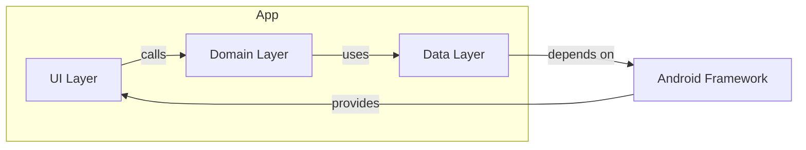
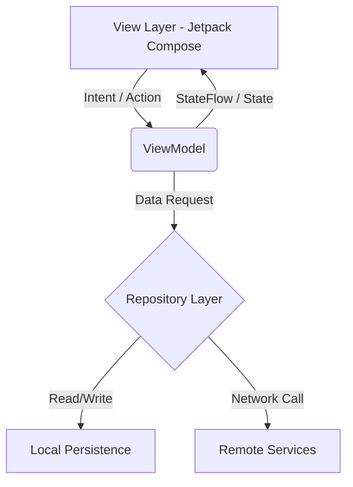

Founderly
========


[](https://github.com/OWNER/REPO/actions/workflows/ci.yml)
[](LICENSE)

Overview
--------

Founderly is an Android app project focused on turning early-stage ideas into disciplined product work. The codebase bundles an Android app module with Gradle configuration, tests, and CI scaffolding. This README explains the project's goals, architecture, and how to get started.

Why this repo exists
--------------------

- Capture a minimal, pragmatic Android app structure you can iterate on.
- Keep tooling and CI in the repo so contributors can run and verify builds quickly.

Quick Highlights
----------------

- Purpose-driven architecture with clear module boundaries.
- CI workflow included to produce a visible build badge after you push.
- Mermaid diagrams to explain the high-level structure.

Architecture (high level)
-------------------------



What to expect in this README
-----------------------------

- Clear getting-started steps to run and build locally.
- An explanation of the included CI workflow and how to make the badges live.

Getting started (local)
-----------------------

1. Install the Android SDK and JDK (recommended JDK 17).
2. Open the project in Android Studio or run from the command line.

From the command line:

```bash
./gradlew assembleDebug
```

If you prefer Android Studio, open the repository root and let Gradle sync.

CI and badges
--------------

This repo includes a basic GitHub Actions workflow that runs a Gradle assemble. After you push these files to GitHub under your account, replace the `OWNER/REPO` placeholders in the badge URLs at the top of this README with your GitHub `owner/repo` path. The CI badge will become active once the workflow runs on GitHub.

Make badges live (summary)

1. Create a new GitHub repository and push this project to it (see the push instructions below).
2. After the first successful push, GitHub Actions will run the workflow. When it finishes, the build badge will reflect the status.
3. Edit the README badges to use your real `OWNER/REPO` path (search-and-replace the placeholder).

Contributing and commits
------------------------

We want readable, meaningful commits. Small, frequent, well-scoped commits are better than artificially inflated noise. If your goal is to show activity, focus on real, useful changes: tests, documentation, bug fixes, and small feature improvements.

If you want to boost visibility the right way:

- Add useful documentation and examples.
- Write tests and CI checks.
- Open issues and PRs, and respond to feedback.

Push instructions (recommended)
-----------------------------

Replace `GITHUB_URL` below with the URL of the repository you create on GitHub.

```bash
git init
git add .
git commit -m "chore: initial project scaffold and README"
git branch -M main
git remote add origin GITHUB_URL
git push -u origin main
```

Files added by this change
-------------------------

- `README.md` — this file with diagrams and badges.
- `.github/workflows/ci.yml` — basic CI to build the project on push/PR.
- `LICENSE` — MIT license file.
- `CONTRIBUTING.md` — short guide for contributors.

Notes and next steps
--------------------

- Replace badge `OWNER/REPO` placeholders in the README after pushing.
- If you want additional badges (codecov, dependency health, static analysis), I can add CI steps and instructions for each.

License
-------

This project is available under the MIT license (see `LICENSE`).

# Founderly

Founderly is the operating system for technical founders. Built on Android using Kotlin and Jetpack Compose, the application serves as a unified workspace for managing startup health, tracking engineering milestones, and engaging with a curated network of founders.

## Architecture & Tech Stack

The application strictly adheres to a modern Android architecture, enforcing unidirectional data flow and clean separation of concerns.

* Language: Kotlin
* UI Toolkit: Jetpack Compose
* Dependency Injection: Hilt 
* Asynchronous Programming: Kotlin Coroutines & Flows
* Image Loading: Coil

### State Management



## UI & Design Philosophy

The application interface rejects generic bloated components in favor of a typography-first editorial aesthetic. 
Key design pillars include:

1. Structural Grid Layouts: Clear hierarchical boundaries using 1dp hairlines instead of drop shadows or heavy containers.
2. Intentional Color Palette: A deep wine dark-mode base providing high contrast for typographic elements.
3. Micro-interactions: Deterministic state animations using Compose Animatables for choreographed, staggered screen entrances.
4. Editorial Typography: Strategic use of wide tracking, strict capitalization rules, and massive hero text for clear visual hierarchy.

## Core Modules

* Auth: Handles secure credential management and session state.
* Dashboard: Aggregates active startup metrics, progress rings, and priority task queues.
* Community: A curated, flat-feed of milestone updates from the founder network.
* Chat: Context-aware AI assistant interface for technical and business logic validation.
* Profile: A deterministic layout mapping a founder's core competencies to their current ventures.

## Build Instructions

Ensure you have Android Studio and the Android SDK configured on your environment.

1. Clone the repository to your local machine.
2. Sync Gradle dependencies.
3. Run the application on a target device or emulator running API 26 or higher.

## Screenshots

Below are the screenshots from the `screenshots` folder included in this repository.

<p align="left">
  
  
  
  
  
  
  
</p>
