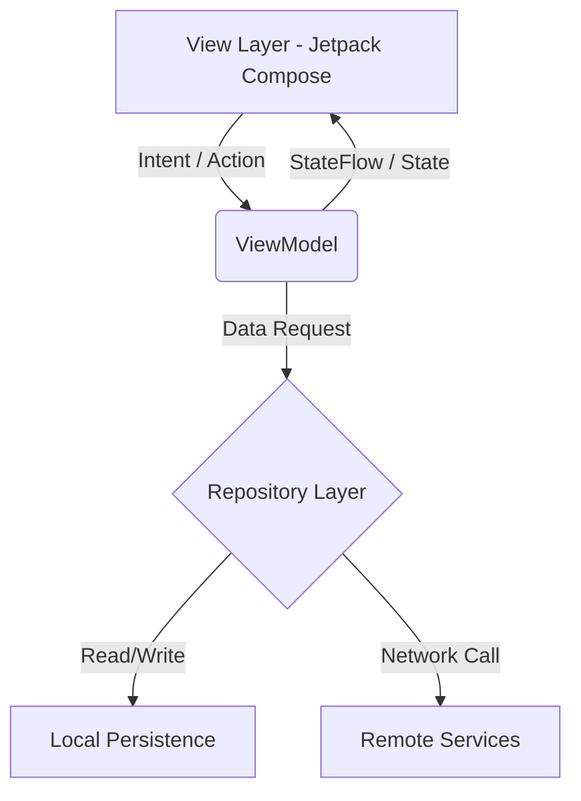

# Founderly

Founderly is the operating system for technical founders. Built on Android using Kotlin and Jetpack Compose, the application serves as a unified workspace for managing startup health, tracking engineering milestones, and engaging with a curated network of founders.

## Architecture & Tech Stack

The application strictly adheres to a modern Android architecture, enforcing unidirectional data flow and clean separation of concerns.

* Language: Kotlin
* UI Toolkit: Jetpack Compose
* Dependency Injection: Hilt 
* Asynchronous Programming: Kotlin Coroutines & Flows
* Image Loading: Coil

### State Management

## UI & Design Philosophy

The application interface rejects generic bloated components in favor of a typography-first editorial aesthetic. 
Key design pillars include:

1. Structural Grid Layouts: Clear hierarchical boundaries using 1dp hairlines instead of drop shadows or heavy containers.
2. Intentional Color Palette: A deep wine dark-mode base providing high contrast for typographic elements.
3. Micro-interactions: Deterministic state animations using Compose Animatables for choreographed, staggered screen entrances.
4. Editorial Typography: Strategic use of wide tracking, strict capitalization rules, and massive hero text for clear visual hierarchy.

## Core Modules

* Auth: Handles secure credential management and session state.
* Dashboard: Aggregates active startup metrics, progress rings, and priority task queues.
* Community: A curated, flat-feed of milestone updates from the founder network.
* Chat: Context-aware AI assistant interface for technical and business logic validation.
* Profile: A deterministic layout mapping a founder's core competencies to their current ventures.

## Build Instructions

Ensure you have Android Studio and the Android SDK configured on your environment.

1. Clone the repository to your local machine.
2. Sync Gradle dependencies.
3. Run the application on a target device or emulator running API 26 or higher.
